<div align="center">

# 🛣️ AI Road Pothole Detection System

### Intelligent Road Damage Detection using YOLOv8 and Streamlit

<p align="center">

An AI-powered Computer Vision application that automatically detects road potholes from images using the YOLOv8 object detection model and provides a modern web interface built with Streamlit.

</p>

<p align="center">


</p>

</div>

---

# 📖 **Project Overview**

Road potholes are one of the major causes of traffic accidents, vehicle damage, and increased road maintenance costs. Manual road inspection is time-consuming, expensive, and often inefficient.

This project presents an AI-powered Road Pothole Detection System that automatically detects potholes from road images using the YOLOv8 object detection model. The application provides a user-friendly Streamlit interface where users can upload road images and instantly receive pothole detection results with bounding boxes.

The project demonstrates the complete Computer Vision pipeline, including data preprocessing, model training, evaluation, inference, and deployment.

---

# **🎯 Objectives**

- Detect road potholes automatically using Artificial Intelligence.
- Reduce manual road inspection efforts.
- Improve road maintenance efficiency.
- Build a real-time image detection application.
- Demonstrate an end-to-end Computer Vision project using YOLOv8.

# **✨ Features**

This project provides an intelligent and user-friendly solution for automatic pothole detection using Computer Vision and Deep Learning.

### **Core Features**

- 🚀 AI-powered road pothole detection using YOLOv8
- 📤 Upload road images through an interactive web interface
- 🧠 Automatic object detection with bounding boxes
- 📊 Displays total detected potholes
- 🎯 Shows average detection confidence
- ⚡ Fast and lightweight YOLOv8 Nano model
- 🖼️ Side-by-side comparison of Original and Detection images
- 📋 Detection summary table
- 📥 Download detection result image
- 🌐 Modern Streamlit web application
- 📱 Responsive and user-friendly interface

---

# **🛠️ Technologies Used**

| Category | Technology |
|-----------|------------|
| Programming Language | Python |
| Deep Learning Framework | Ultralytics YOLOv8 |
| Computer Vision | OpenCV |
| Machine Learning | NumPy |
| Data Handling | Pandas |
| Image Processing | Pillow (PIL) |
| Web Application | Streamlit |
| Development Environment | Google Colab & VS Code |
| Version Control | Git & GitHub |

---

# **📂 Project Structure**

```text
Road-Pothole-Detection-System/
│
├── app.py
├── README.md
├── requirements.txt
├── Road_Pothole_Detection.ipynb
├── best.pt
│
├── screenshots/
│   ├── home.png
│   ├── upload.png
│   ├── detection.png
│   ├── metrics.png
│   ├── summary.png
│   ├── results.png
│   ├── pr_curve.png
│   ├── f1_curve.png
│   ├── p_curve.png
│   └── r_curve.png
│
└── assets/
```

---

# **📊 Dataset Information**

| Attribute | Details |
|-----------|---------|
| Dataset Name | Road Pothole Detection Dataset |
| Source | Kaggle |
| Annotation Format | Pascal VOC (XML) |
| Converted Format | YOLO TXT |
| Total Images | 665 |
| Total Annotation Files | 665 |
| Number of Classes | 1 |
| Target Class | Pothole |

---

# **🤖 Model Information**

| Parameter | Value |
|-----------|-------|
| Model | YOLOv8 Nano (YOLOv8n) |
| Framework | Ultralytics |
| Task | Object Detection |
| Classes | 1 (Pothole) |
| Image Size | 640 × 640 |
| Epochs | 50 |
| Batch Size | 16 |
| Optimizer | Auto |
| Platform | Google Colab GPU |

# **📈 Model Performance**

The YOLOv8 Nano model was successfully trained on the Road Pothole Detection dataset. The model achieved promising performance for detecting potholes in road images while maintaining fast inference speed and low computational requirements.

### **Performance Metrics**

| Metric | Value |
|---------|------:|
| Precision | **87.80%** |
| Recall | **70.25%** |
| mAP@50 | **84.19%** |
| mAP@50-95 | **53.01%** |

### **Training Configuration**

| Parameter | Value |
|-----------|-------|
| Model | YOLOv8 Nano (YOLOv8n) |
| Epochs | 50 |
| Image Size | 640 × 640 |
| Batch Size | 16 |
| Framework | Ultralytics YOLOv8 |
| Hardware | Google Colab GPU |

---

# **📷 Application Screenshots**

The following screenshots demonstrate the complete workflow of the Road Pothole Detection System.

## **🏠 Home Interface**

> Add Screenshot Here

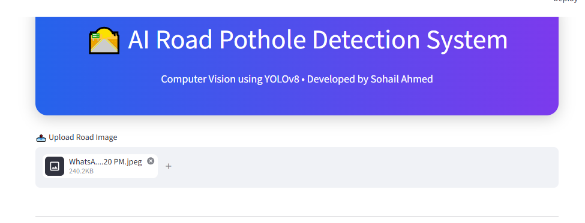


---

## 📸 Application Screenshots

### 🏠 Home Interface


---

### 📤 Image Upload

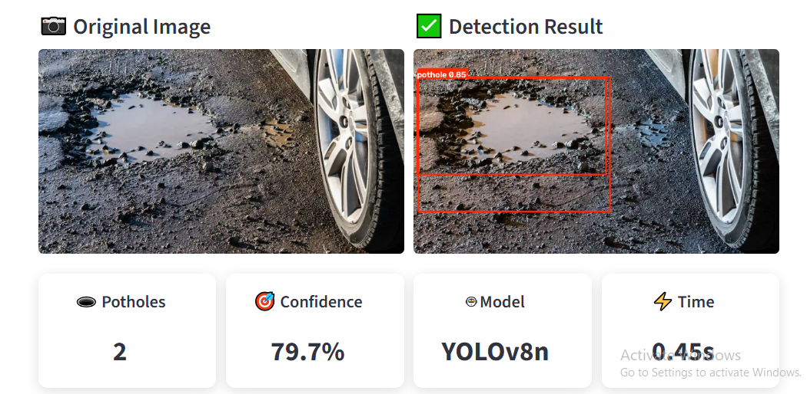

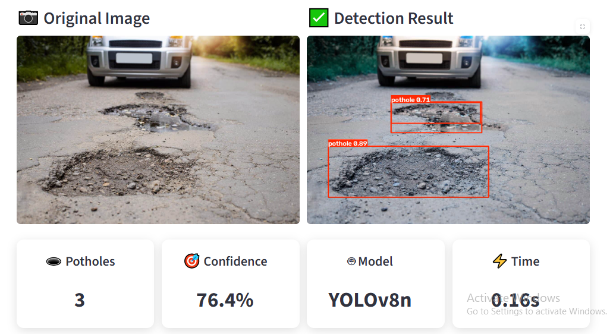

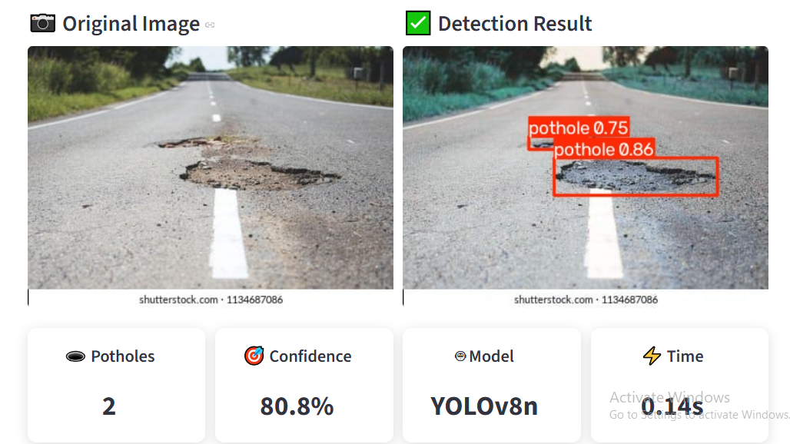

---

### 🕳️ Pothole Detection Result

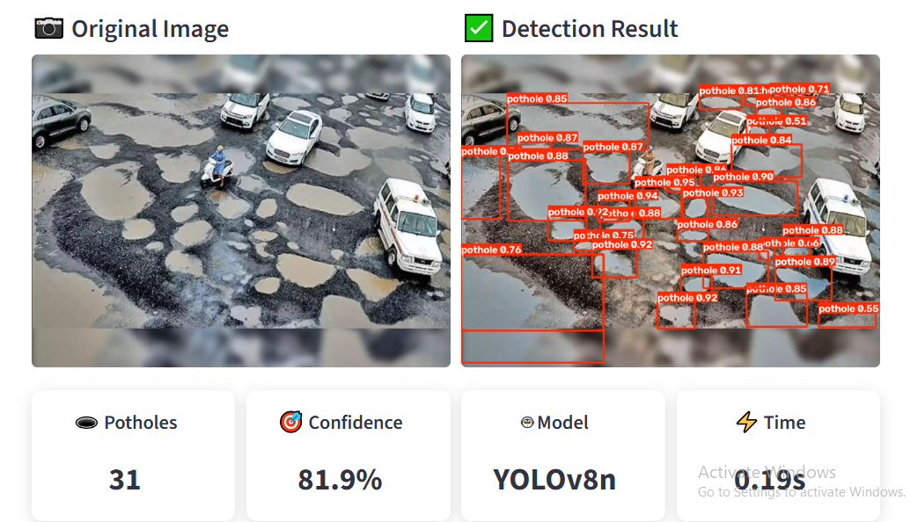

---

### 📊 Detection Metrics

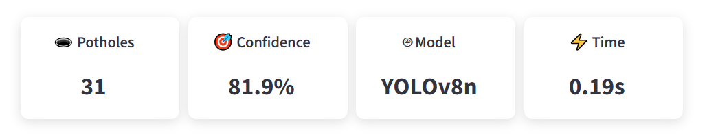

---

### 📝 Detection Summary

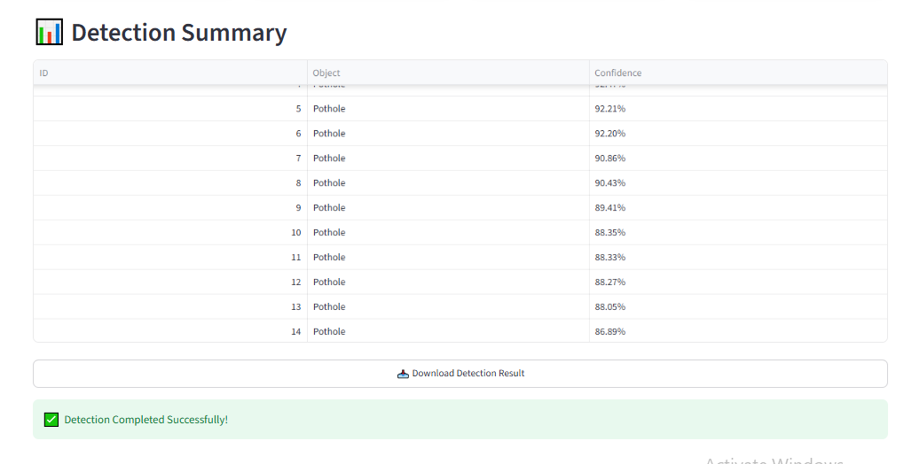

---

### 🧠 Model Training

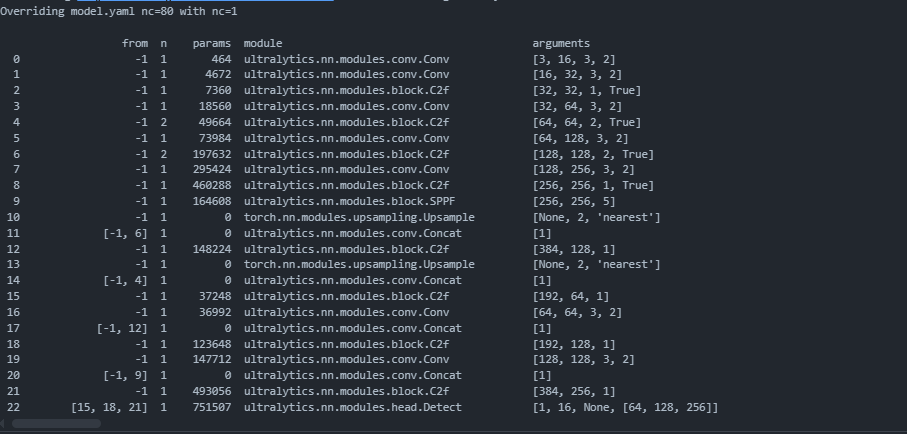

---

### 📈 Final Training Metrics

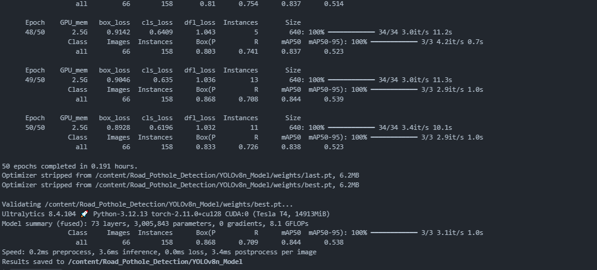

---

### 📉 Evaluation Metrics

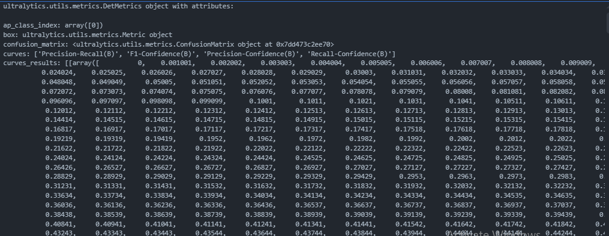

---

### 📋 Final Evaluation

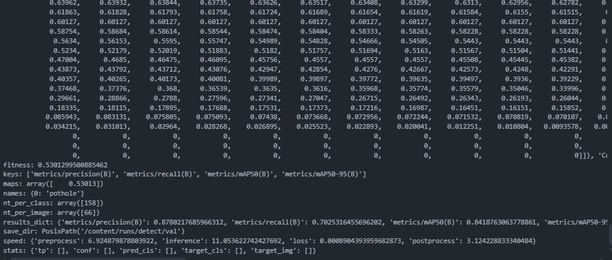

---

### 🎯 Precision-Recall Curve

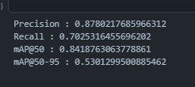

### **3. Install Required Dependencies**

```bash
pip install -r requirements.txt
```

### **4. Add the Trained Model**

Copy the trained **best.pt** model into the project root directory.

Project Structure:

```text
Road-Pothole-Detection-System/
│
├── app.py
├── best.pt
├── requirements.txt
└── README.md
```

### **5. Run the Application**

```bash
streamlit run app.py
```

The application will automatically open in your default web browser.

---

# **▶️ How to Use**

1. Launch the Streamlit application.
2. Click **Upload Road Image**.
3. Select a road image from your computer.
4. Wait for the AI model to process the image.
5. View the detected potholes with bounding boxes.
6. Check:
   - Total Potholes
   - Average Confidence
   - Detection Summary
7. Download the processed image if required.

---

# **🚀 Future Improvements**

This project can be further enhanced by adding the following features:

- 📹 Real-time webcam pothole detection.
- 🎥 Video-based pothole detection.
- 📍 GPS location integration.
- ☁️ Cloud deployment.
- 📱 Mobile application support.
- 🗺️ Road damage mapping.
- 📄 Automatic PDF inspection reports.
- 🔔 Road maintenance alert system.
- 🤖 Multi-class road damage detection.

---


# **🙏 Acknowledgements**

Special thanks to:

- Ultralytics YOLOv8
- Kaggle
- Streamlit
- OpenCV
- Google Colab
- VS Code
- Python Community

for providing excellent open-source tools and resources that made this project possible.

---

# **📄 License**

This project is licensed under the **MIT License**.

You are free to use, modify, and distribute this project for educational and research purposes.


# **📌 Repository Highlights**

## **Key Achievements**

- ✅ End-to-End Computer Vision Project
- ✅ YOLOv8 Object Detection Model
- ✅ Streamlit Web Application
- ✅ Professional User Interface
- ✅ Model Training and Evaluation
- ✅ Real-Time Image Inference
- ✅ GitHub Portfolio Ready

---

# **📊 Project Workflow**

```text
Road Images
      │
      ▼
Dataset Collection
      │
      ▼
Data Preprocessing
      │
      ▼
Annotation Conversion
(XML → YOLO)
      │
      ▼
Dataset Split
      │
      ▼
YOLOv8 Model Training
      │
      ▼
Model Validation
      │
      ▼
Performance Evaluation
      │
      ▼
Streamlit Application
      │
      ▼
Road Pothole Detection
```

---

# **📚 Learning Outcomes**

Through this project, the following concepts were implemented and understood:

- Computer Vision Fundamentals
- Deep Learning for Object Detection
- YOLOv8 Training Pipeline
- Data Annotation Conversion
- Image Processing using OpenCV
- Streamlit Web Application Development
- Model Evaluation Techniques
- GitHub Project Documentation

---

# **💡 Why This Project?**

Road potholes are one of the major causes of road accidents and vehicle damage worldwide. Detecting potholes manually is time-consuming and expensive.

This AI-powered solution automates pothole detection using Deep Learning, making road inspection faster, more accurate, and scalable.

---

# **🌟 Project Status**

| Status | Progress |
|---------|----------|
| Dataset Preparation | ✅ Completed |
| Data Preprocessing | ✅ Completed |
| YOLOv8 Training | ✅ Completed |
| Model Validation | ✅ Completed |
| Model Evaluation | ✅ Completed |
| Streamlit Application | ✅ Completed |
| GitHub Documentation | ✅ Completed |

---
# **⭐ Support the Project**

If you found this project useful, please consider giving it a ⭐ on GitHub.

Your support helps improve the project and motivates future development.

---
# **👨‍💻 Author**

## **Sohail Ahmed**

**BS Telecommunications Engineering**

Passionate about:

- Artificial Intelligence
- Data Science
- Machine Learning
- Computer Vision
- Deep Learning

---

# **📬 Contact**

**Sohail Ahmed**

📧 Email: nextgenaihub.com@gmail.com

🔗 LinkedIn: https://www.linkedin.com/in/sohail-ahmed-devsil

🐙 GitHub: https://github.com/sohail-ahmed-26

---

<div align="center">

# 🚀 Keep Building. Keep Learning. Keep Growing.


---

### ⭐ Thank you for visiting this project.

If you found this project helpful or interesting,

please consider giving it a **⭐ Star** on GitHub.

It motivates me to build more impactful AI solutions.

---

### 👨‍💻 Developed with ❤️ by

# **Sohail Ahmed**

**AI Engineer | Data Scientist | Computer Vision Enthusiast**

*"Turning ideas into intelligent solutions through Artificial Intelligence."*

</div>